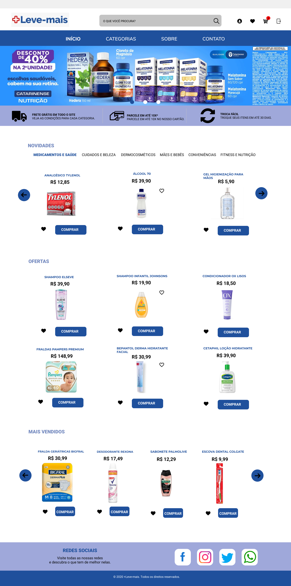

# Farmácia +Leve-mais
Farmácia +Leve-mais, um projeto de e-commerce para a eletiva Engenharia de Software I com React.js.

## Tecnologias utilizadas
- JavaScript
- React.js
- React Router
- React Redux
- Material UI
- OAuth
- Python
- Django
- Axios

## Protótipo
🎨[Clicando aqui](https://www.figma.com/design/pzXAKi389zc3Mk54alLaG2/Layout-ecommerce?node-id=0-1&t=7ACMeSlWmbto0LX1-1) é possível verificar o layout do projeto, desenvolvido no Figma.

## Equipe
Professor: Márcio Bueno
Nome   | Atividade
--------- | ------
Arthur Aragão | Full-stack
Deborah Pereira | Front-end
José Arthur | Back-end
Lucas Nardi | Front-end
Túlio Aoki | Back-end

## Instruções
- Certifique-se que você tem instalado na sua máquina o **npm**.
- Pelo terminal navegue até a pasta do projeto utilizando `cd ecommerce-engsoft`.
- Execute o comando `npm install` para instalar as dependências.
- Após isso execute o comando `npm start` e a aplicação deverá ser inicializada em uma aba no seu navegador.
